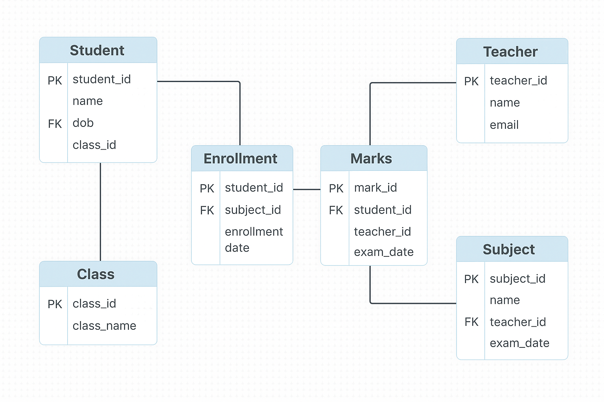

# 📚 School Database Schema

This repository contains a well-structured relational database schema for a **School Management System**, built using **MySQL**.

## 🏗️ Entities and Relationships

- **Teachers** teach multiple subjects.
- **Subjects** are taught by one teacher.
- **Classes** group students together.
- **Students** belong to one class.
- **Enrollments** track which subjects a student is enrolled in.
- **Marks** track exam scores for each student per subject.

## 🧩 Database Tables

- `Teachers (teacher_id, name, email, hire_date)`
- `Subjects (subject_id, name, teacher_id)`
- `Classes (class_id, class_name)`
- `Students (student_id, name, dob, class_id)`
- `Enrollments (enrollment_id, student_id, subject_id, enrollment_date)`
- `Marks (mark_id, student_id, subject_id, marks_obtained, exam_date)`

## 🔑 Keys & Constraints

- **Primary Keys**: Each table has an `AUTO_INCREMENT` primary key.
- **Foreign Keys**: Used to enforce relationships between entities.
- **Unique Constraints**: Example - email in Teachers.

## 💡 ER Diagram

## 🚀 How to Use

1. Open `school_database_schema.sql` in **Visual Studio Code** to view or edit the SQL script.
2. Open **HeidiSQL**, connect to your MySQL server, and run the SQL script to create the database schema.
3. Extend the schema with sample data (`INSERT INTO`) or queries as needed.

## 🛠️ Tools Used

- **Visual Studio Code** (for editing `.sql` files)
- **HeidiSQL** (for executing SQL and managing MySQL database)
- **GitHub** (for version control and sharing)

---

## 📄 License

This project is open-source and free to use for academic or personal purposes.
